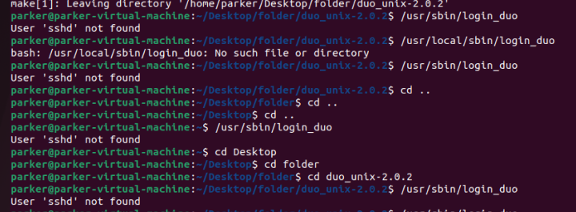

# Welcome to DUO Ubuntu doc!
# 🧾 Description
- Setting up a UBUNTU box to use the DUO MFA with the command line 

## 🌐 Action to perform 


1. First, update the ubuntu box with the commands

	```
    sudo apt update && sudo apt upgrade
    ```
2. The first thing that I did was to install the the tools like curl/gwet/gcc as well. The commands that I have placed in,  The GNU C Compiler, commonly referred to as GCC, is an essential piece of open source software development. Hence, it is available in the Ubuntu repositories as the `gcc` package.
3. Curl is going to be used to download the file from the net 

The GNU C Compiler can be installed using the following command:

```bash
sudo apt install gcc
```

```
sudo apt install build-essential
sudo apt install curl
```

This is for to install the basic tools:

4. Second thing to do is, Download is DUO UNIX for the UBUNTU home lab, 

    ```
    curl --content-disposition https://dl.duosecurity.com/duo_unix-latest.taz.gz    
    ```

    - you would have to use either curl wget for ubuntu or would you have to go on the website.  https://dl.duosecurity.com/duo_unix-latest.tar.gz
    - MAKE SURE to extract the file into a place where it is easily accessible
5. third thing to do is, Download the OpenSSL for ubuntu to make a connection between duo and ubuntu
    ```
    sudo apt-get install libssl-dev
    ```
OpenSSL development headers and libraries are required for login_duo 

6. The next thing that you wanna do: 
	
    ```
	$ ./configure --prefix=/usr && make && sudo make install
	```

- you will get this result right here after you install it. 
-

7. Its time to configure a file called `login_duo.conf`, its in the folder called 


type in your keys like into designated spot like integration, secret, and api host name
I was getting sshd_config, going to install SSH so I can see if that works out with it 



I used Google, that i would have to use SSH(secure shell ) 
TIME to install SSH

```
sudo apt install ssh 
```


I had to reinstall everything from the start of it. 
I had to watch and read everything carefully. 
I finally got it to work. 

I ran all of the commands along side updating the document through using
```
sudo gedit /etc/duo/login_duo.conf
```
I made sure to put the same name from my ubuntu server to the user in duo, and it finally worked. I had to install essentials which had contained other commands that i could have used. 
A person has to install SSH, 

this is my success! 
