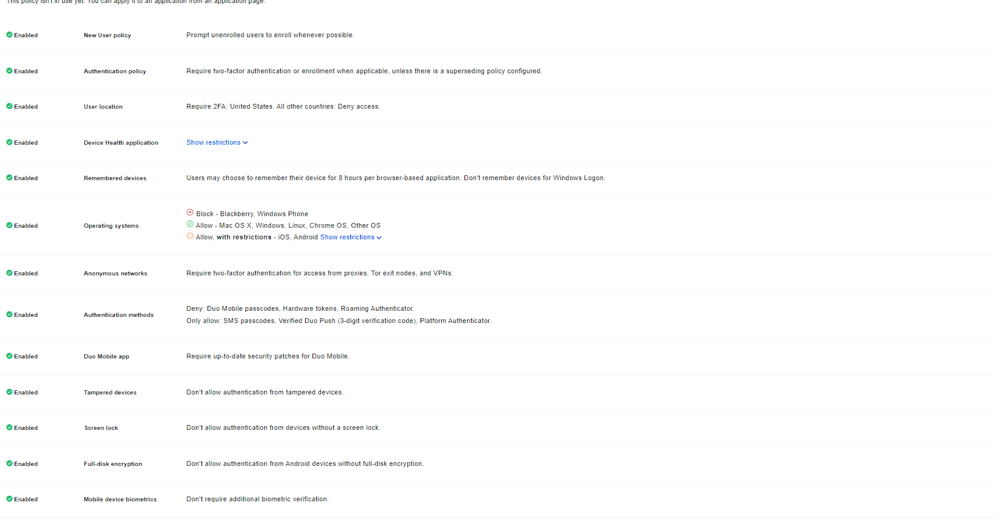
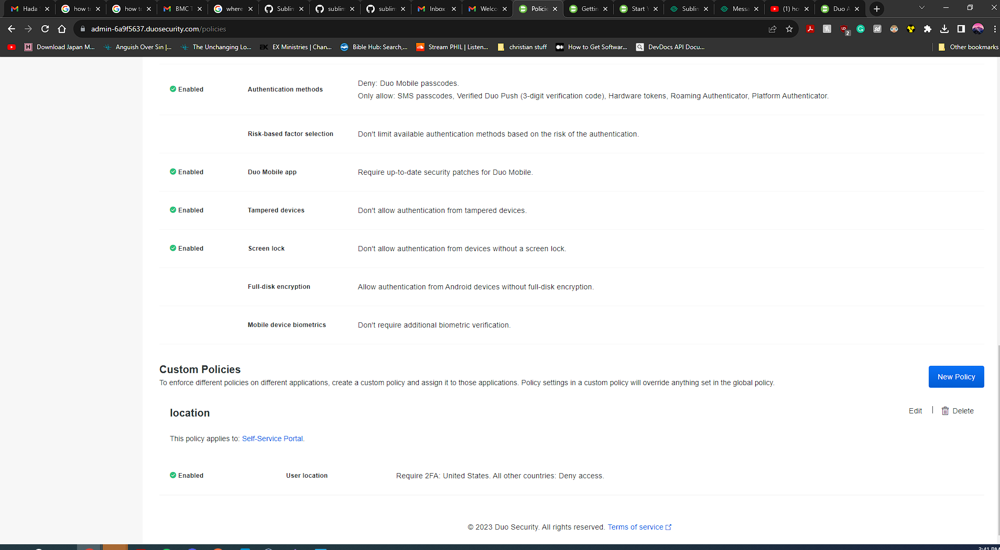
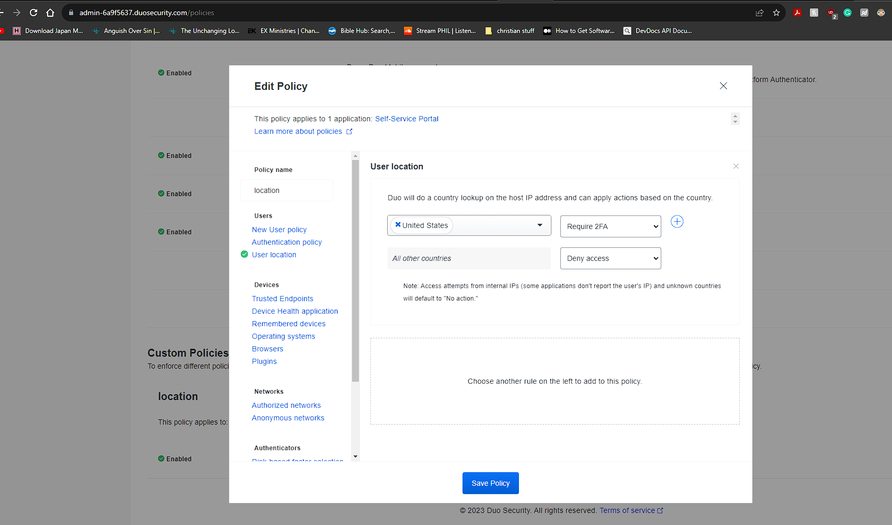
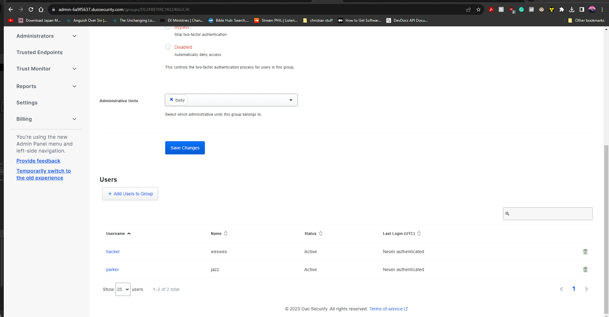

# Welcome to my DUO Documents
# 🧾 Description
- The main focus of this prompt will be to create two users, and apply policies to them through the use of DUO. 

## 🌐 Action to perform 
1.  First step is to setup a account with DUO security, install the MFA app whether it be android or iphone
2. I have install both DUO platform users on my phone
3. things to look out for the policies that in place for the phone
4. I can't use this phone if I was out of the country 
 These are the policies that I have chosen, I do believe that every single one is legitimate because the high intense security that we all need the world. For example, location and the phone would have to have full disk encryption on board because we don't outside attack coming if the person is outside of the country or doesn't have a updated phone. 
- Setting up two users with parker, hacker. They are under the policy called RULEZ. 

	- Listed features: User location, 2FA, Update app, no access from tampered devices, Android particular have to have Full-Disk Encryption, Screen Lock is mandatory, Allowed only mostly IOS, OS X, Windows, Linux, Chrome OS. I denied windows phone and blackberries due to the security Risk. Have deny blocker for outdated phones. 

